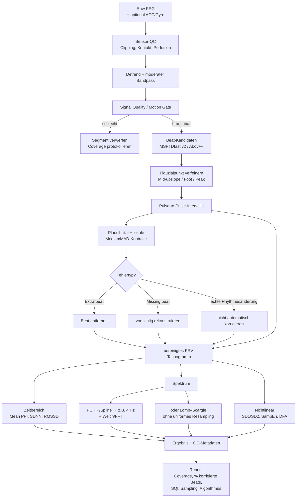

# PPG-basierte HRV-Algorithmen: Stand der Technik, Validierung und praktische Empfehlung

## Executive Summary

**Die wichtigste Schlussfolgerung:** Für PPG-basierte HRV gibt es derzeit keinen einzelnen „besten Algorithmus“. Die robusteste Lösung ist eine **Pipeline aus gutem Beat-Detektor, geeigneter Fiduzialpunktwahl, expliziter Signalqualitätskontrolle, konservativer Artefaktbehandlung und HRV-spezifischer Auswertung**. Für universelle, offene Implementierungen ist **MSPTDfast v2 / MSPTD** derzeit eine der überzeugendsten Baselines; für lange, überwiegend ruhige Aufzeichnungen ist **Aboy++ in pyPPG** ebenfalls stark. Bei intensiver Bewegung schneiden **bewegungsbewusste Candidate-Tracking-/Graph-Verfahren oder Multi-Channel-Ansätze** besser ab als bloße Peak-Detektoren. Ein Deep-Learning-Modell ist gegenwärtig **nicht automatisch die beste Wahl für HRV**, weil viele ML-Arbeiten HR oder Artefakte optimieren, nicht die für HRV entscheidende Beat-to-Beat-Zeitgenauigkeit. citeturn12search0turn10search15turn28academia2

Ein fundamentaler Punkt wird in Produktliteratur und selbst in wissenschaftlichen Arbeiten häufig verwischt: **PPG misst streng genommen Pulse Rate Variability (PRV), nicht ECG-HRV.** Bei einem konstanten Zeitversatz zwischen R-Zacke und peripherem Puls wäre das unproblematisch; beat-to-beat-Änderungen der Pulse Arrival/Transit Time sowie Änderungen der Pulsform wirken jedoch direkt auf die PPG-Intervalle. Eine große klinische Studie mit 931 Personen fand deshalb trotz praktisch identischer mittlerer Herzfrequenz systematische Unterschiede bei SDNN, rMSSD und pNN50; eine kontrollierte Studie aus 2026 fand dagegen bei 66 Personen in Sinusrhythmus und Ruhe sehr gute Übereinstimmung für bestimmte globale Kennwerte wie SDNN. Beide Ergebnisse sind miteinander vereinbar: **PPG-HRV funktioniert am besten bei guter Perfusion, wenig Bewegung, Sinusrhythmus, kontrollierter Signalqualität und sorgfältig gewähltem HRV-Merkmal; „PPG = ECG-HRV“ als generelle Gleichsetzung ist nicht haltbar.** (Kantrowitz et al., 2025; Zuern et al., 2026). citeturn48view0turn32view0turn33view2

Für eine neue Implementierung ohne vorgegebenen Datensatz wäre meine evidenzbasierte Default-Konfiguration:

| Anwendung | Bevorzugter Ansatz | Kernaussage |
|---|---|---|
| **Ruhe / Schlaf / Finger-PPG** | MSPTDfast v2 oder Aboy++; Mid-upslope/Foot-Fiduzial; robuste lokale Artefaktkontrolle | Höchste praktische Erfolgschance; SDNN und Mittelwerte meist robuster als RMSSD/HF/Entropy. citeturn12search0turn43search1turn33view2 |
| **Wrist-PPG, ambulant mit geringer–mittlerer Bewegung** | MSPTDfast v2 + ACC/IMU-SQI + Segment-Rejection + robuste IBI-Korrektur | Nicht versuchen, jedes Segment zu „retten“; Abstention ist oft besser als aggressive Interpolation. citeturn12search0turn32view2 |
| **Hohe Bewegung** | Multi-Channel-/ACC-gestütztes Candidate Tracking, z. B. graphbasierter Shortest-Path-Ansatz | Herkömmliches Peak Picking allein reicht typischerweise nicht. Huang erreichte bei Zwei-Kanal-PPG r = 0,98 und 2,2 % IBI-Fehler. citeturn28academia2 |
| **Klinische HRV / Arrhythmien / autonome Diagnostik** | ECG als Referenz; PPG nur nach populations- und metric-spezifischer Validierung | Insbesondere bei AF, Gefäßerkrankung, Lagewechsel und stark variabler Hämodynamik PRV nicht ungeprüft als HRV deklarieren. citeturn34academia0turn48view0turn19academia1 |

**Sampling:** Wenn HRV ein primäres Ziel ist, sind **≥50 Hz, vorzugsweise etwa 100 Hz Rohdaten** ein vernünftiger Engineering-Default. Niedrigere Raten können funktionieren: Zuern et al. erzielten bei 25 Hz und sub-sample Peak-Interpolation gute Ruheergebnisse; simulationsbasierte Arbeiten zeigen, dass selbst etwa 14 Hz bei hohem SNR und zeitlicher Interpolation sehr geringe Quantisierungsfehler erlauben können. Das ist aber kein Argument, einen neuen HRV-Sensor absichtlich mit 14–25 Hz zu bauen, wenn Energie- und Speicherbudget höhere Raten zulassen. (Choi & Shin, 2017; Zaunseder et al., 2022; Zuern et al., 2026). citeturn20search2turn20academia38turn33view0

**Validierung:** Beat-Detection-F1 alleine reicht nicht. Für HRV sind zumindest **beatweise IBI-MAE/RMSE, Bias und 95-%-Limits-of-Agreement sowie Fehler der tatsächlichen HRV-Endpunkte** notwendig. RMSSD, HF und Entropie reagieren wesentlich empfindlicher auf wenige Millisekunden Timing-Jitter bzw. einzelne zusätzliche/fehlende Beats als mittlere Herzfrequenz oder teilweise SDNN. Zuern et al. fanden beispielsweise ausgezeichnete Übereinstimmung für SDNN (ρ = 0,98), aber deutlich schwächere Resultate für Sample Entropy und einige kurzzeitige/nonlineare Parameter. citeturn33view1turn33view2

**Confidence der Gesamtbewertung:** **hoch** für HRV-Grundlagen, PRV-vs-HRV-Unterscheidung und die offenen Beat-Detector-Benchmarks; **mittel** für die Rangfolge MSPTDfast v2 versus Aboy++, weil die Datensätze und Zielmetriken unterschiedlich sind; **mittel bis niedrig** für eine universelle Empfehlung unter intensiver Free-living-Bewegung, weil hierfür noch zu wenige öffentlich reproduzierbare End-to-End-HRV-Benchmarks existieren. Die jüngste systematische Übersichtsarbeit von 2026 unterstreicht, wie aktiv und heterogen dieses Validierungsfeld weiterhin ist. (Xu et al., 2026). citeturn22search0

## Definition und Geltungsbereich

ECG-HRV basiert konventionell auf den Abständen normaler konsekutiver Herzschläge, also **NN-Intervallen**, die aus ECG-R-R-Intervallen nach Rhythmus- und Artefaktbereinigung abgeleitet werden. PPG erfasst dagegen die periphere Blutvolumen-Pulswelle. Daraus entstehen Peak-to-Peak-, Foot-to-Foot- oder andere Pulse-to-Pulse-Intervalle. Physiologisch korrekt ist daher die Bezeichnung **PRV**; „PPG-derived HRV“ ist sinnvoll als Anwendungsterm, sollte aber nicht implizieren, dass die Messgröße identisch mit ECG-HRV ist. Diese Unterscheidung war bereits Gegenstand der klassischen Review von Schäfer & Vagedes und wurde durch neuere klinische Daten nochmals deutlich bestätigt. (Task Force, 1996; Schäfer & Vagedes, 2013; Kantrowitz et al., 2025). citeturn20search0turn18search0turn48view0

Formal kann man für einen PPG-Fiduzialpunkt schreiben

\[
t_{PPG,i}=t_{R,i}+PAT_i
\]

und damit

\[
PPI_i=t_{PPG,i+1}-t_{PPG,i}
     =RR_i+(PAT_{i+1}-PAT_i).
\]

Ein **konstanter** PAT-/PTT-Anteil verschiebt nur beide Pulszeitpunkte und verschwindet im Intervall. Eine **beatweise Änderung** von Pulse Arrival Time fügt hingegen direkt Variabilität hinzu oder nimmt sie weg. PAT beinhaltet beim Bezug auf die ECG-R-Zacke neben der eigentlichen Gefäßlaufzeit auch elektromechanische Komponenten; Blutdruck, arterielle Steifigkeit, Vasomotorik, Körperlage und Pulswellenmorphologie beeinflussen diesen Anteil. Genau deshalb verschlechtert sich die Austauschbarkeit zwischen HRV und PRV beispielsweise bei Lagewechseln, hämodynamischen Änderungen und bestimmten Erkrankungen. (Lin et al., 2025; Zuern et al., 2026). citeturn19academia1turn33view2

Die üblichen HRV-Merkmalsgruppen sind:

| Domäne | Typische Größen | PPG-spezifische Sensitivität |
|---|---|---|
| **Zeitbereich** | Mean NN/PPI, SDNN, RMSSD, SDSD, pNN50 | Mean PPI ist relativ robust; RMSSD/pNN50 reagieren stark auf lokales Beat-Timing und einzelne Artefakte. citeturn20search1turn33view2 |
| **Frequenzbereich** | VLF, LF, HF, LF/HF | Erfordert ein korrektes Tachogramm; Timing-Jitter und Artefaktkorrektur können besonders HF beeinflussen. Klassische Kurzzeitbänder sind LF 0,04–0,15 Hz und HF 0,15–0,40 Hz. citeturn20search22turn33view4 |
| **Nichtlinear** | Poincaré SD1/SD2, SampEn, ApEn, DFA α1/α2 | Häufig noch empfindlicher gegenüber falschen Beats, Datenlänge und Preprocessing. In der 2026er Validierung war SD2 ausgezeichnet, SampEn/DFα1/SD1:SD2 dagegen schwächer. citeturn33view1turn33view2 |

Die konventionelle Kurzzeit-HRV wird meist über ungefähr **5 Minuten** analysiert; ultra-kurze Fenster unter fünf Minuten können für einzelne Kennwerte funktionieren, dürfen aber nicht ohne metric-spezifische Validierung wie 5-Minuten-Werte interpretiert werden. Frequenzbereichskennwerte sind besonders von Fensterlänge, Detrending und Spektralmethode abhängig. (Task Force, 1996; Shaffer & Ginsberg, 2017). citeturn20search0turn20search4

Ein weiterer Interpretationsfehler betrifft **LF/HF**: Der Quotient sollte nicht als präziser, universeller „Sympathikus/Parasympathikus-Balancewert“ behandelt werden. LF ist physiologisch multifaktoriell, und Änderungen durch Atmung, Baroreflex, Messdauer und Methodik machen eine einfache Zwei-Zweig-Interpretation problematisch. Die konservativere Verwendung ist als deskriptive spektrale Größe innerhalb eines standardisierten Protokolls. citeturn20search1turn20search4

Typische Einsatzgebiete unterscheiden sich erheblich in der Schwierigkeit. Finger-PPG in Ruhe, Schlaf und kontrollierte klinische Kurzzeitmessungen liegen am günstigen Ende. Wrist-Wearables bei Alltagstätigkeit müssen Bewegungsartefakte, wechselnden Hautkontakt und Perfusionsänderungen bewältigen. Free-living-Studien zeigen dementsprechend wesentlich schwächere Übereinstimmung als kontrollierte Ruheversuche. Remote-PPG aus Video ist nochmals ein eigenes Problem mit zusätzlicher Beleuchtungs- und Bewegungsvariabilität und sollte bei der Bewertung von Kontakt-PPG-Algorithmen nicht ohne Kennzeichnung vermischt werden. citeturn32view2turn38academia13

## Algorithmische Klassen und empfohlene Pipeline

Die stärksten Systeme behandeln HRV **nicht** als „Bandpass → Peaks → RMSSD“, sondern als mehrstufiges Qualitätsproblem. Der Beat-Detektor ist wichtig, aber Fehler können genauso aus Filterwahl, Fiduzialpunkt, Sampling, fehlenden/zusätzlichen Beats, PTT-Variation und unsachgemäßer Interpolation entstehen. Charlton et al. zeigen in ihren offenen Benchmarks außerdem, dass kein Peak-Detektor unter allen Signalbedingungen dominant ist; MSPTD/MSPTDfast gehört jedoch zu den konsistent starken, breit getesteten Verfahren. citeturn10search0turn12search0

| Klasse | Prinzip und typisches Preprocessing | Sinnvolle Parameter | Rechenaufwand* | Bewegung/Artefakte | Stärken | Schwächen |
|---|---|---|---|---|---|---|
| **Lokale systolische Peak-Detektion** | Detrend/Bandpass → lokale Maxima → Mindestabstand/Prominenz. | Bandpass in Ruhe z. B. grob 0,5–4/8 Hz; Mindestabstand aus maximal plausibler HF; adaptive Höhe/Prominenz statt absolutem Threshold. Zuern verwendete bei 25 Hz 0,6–4 Hz sowie `find_peaks` plus Interpolation. citeturn33view0 | ~O(N) nach Filterung | **gering–mittel** | Extrem einfach, streamingfähig, niedriger Stromverbrauch. | Pulsamplitude und Pulsform ändern sich; Bewegung erzeugt zusätzliche Peaks; der Maximalpunkt kann innerhalb der Pulswelle zeitlich wandern. |
| **Foot/Onset bzw. Derivativ-Fiduzialpunkt** | Pulsbeginn über Ableitung, Tangentenmethode oder Steigungsmaximum; Intervalle zwischen homogenen Fiduzialpunkten. | Ableitung vorher glätten; Suchfenster an vorherigen Beat koppeln. | ~O(N) | **mittel** bei sauberem Signal, schlechter bei Baseline-/Hochfrequenzrauschen | Physiologisch näher am Eintreffen der Pulswelle; reduziert teilweise Formfehler des Peaks. | Foot ist bei schlechter Perfusion und Baseline-Drift schwer zu bestimmen; Ableitungen verstärken Rauschen. Singstad zeigte starke Abhängigkeit von der Fiduzialpunktwahl. citeturn43search1 |
| **Mid-upslope / relative Systolenflanke** | Fiduzialpunkt zwischen Onset und Peak bzw. auf der systolischen Aufwärtsflanke. | MSPTDfast v2 verwendet Midpoints auf der Aufwärtsflanke; Peralta et al. untersuchten mehrere Fiduzialpunkte explizit für PRV. citeturn13view1turn20search3 | ~O(N) nach Onset/Peak-Detection | **mittel–hoch** für Morphologieänderungen | Guter Kompromiss zwischen noisy Foot und morphologieabhängigem Peak; für PRV oft die beste klassische Wahl. | Erfordert robuste Bestimmung sowohl von Onset als auch Peak. |
| **Multiscale-Detektoren: MSPTD/AMPD-Familie** | Peaks werden über mehrere zeitliche Skalen auf Konsistenz geprüft, statt nur einen festen Threshold zu verwenden. | MSPTDfast v2: intern Downsampling auf 20 Hz, Mindest-HR 30 bpm, typische Fenster 6 s; Skalenraum wird gegenüber MSPTD reduziert. citeturn12search0turn13view1 | grob O(N·S), Fast-Version mit stark reduziertem S | **mittel–hoch**, solange Pulse noch morphologisch erkennbar | Sehr wenige handgetunte Amplitudenthresholds, starkes öffentliches Benchmarking, offene Implementierung. | Bei massiver Bewegungsüberlagerung existiert eventuell kein echter Puls mehr, den Multiscale-Logik finden könnte. |
| **Hilbert-/Wavelet-/Envelope-Detektoren** | Bandbegrenzung → Transformation/Envelope → Peakentscheidung. HDEM verwendet eine doppelte Hilbert-Hüllkurve. | Filter und Skala auf erwartete Pulsfrequenz; adaptive Schwellen. | meist O(N log N) bzw. O(N·K) | **mittel** | Gute Peakverstärkung und gute kontrollierte Ergebnisse; HDEM erreichte in einer Studie 99,45 % Sensitivität für PPG. (Esgalhado et al., 2022). citeturn43search1 | Mehr Rechenaufwand; Transformation garantiert keine robuste Beat-Zeit bei Bewegungsartefakt. |
| **Beat-/IBI-Korrektur** | Physiologische Plausibilität + Abweichung vom lokalen Median; extra Beat wird entfernt, missing beat rekonstruiert; danach ggf. Interpolation. | Schwellen kontextabhängig; robuste Median/MAD-Logik ist besser als globale Mittelwertschwellen. Zuern entfernte in einer Ruhepopulation PPI <600 oder >1500 ms sowie >5 robuste SD/MAD-Ausreißer. citeturn33view0 | O(B) bis O(B log W) | **entscheidend** | Ein einzelner Fehler kann sonst RMSSD/HF massiv verzerren. | Aggressive „Korrektur“ kann echte Arrhythmie oder echte autonome Variabilität wegfiltern. |
| **SQI/Artefakterkennung und Segment-Rejection** | Morphologie, Periodizität, SNR, Clipping, Perfusion und optional ACC/Gyro entscheiden, ob ein Segment überhaupt ausgewertet wird. | 5–10-s-SQI-Fenster sind praktisch; Schwellen sensorspezifisch kalibrieren. Zuern entfernte Aufnahmen oberhalb einer studienspezifischen Gyro-Power-Schwelle. citeturn33view0 | O(N) | **hoch**, wenn ein IMU-Kanal vorhanden ist | Verhindert „garbage in, plausible HRV out“. | Reduziert Coverage; Schwellen lassen sich nicht ohne Weiteres zwischen Geräten übertragen. |
| **Interpolation / Resampling des Tachogramms** | Unregelmäßige PPI-Zeitpunkte werden für FFT/Welch auf äquidistantes Raster gebracht; alternativ Lomb–Scargle direkt auf irregulären Daten. | Für klassische FFT-Auswertung häufig 4 Hz, z. B. PCHIP/cubic; Lam verwendete PCHIP auf 4 Hz. Zuern verwendete Lomb–Scargle, um mit fehlenden Werten umgehen zu können. citeturn33view4turn33view0 | Spline ~O(B); FFT O(M log M); klassisches Lomb–Scargle ~O(BF) | abhängig von vorgelagerter Artefaktkontrolle | Standardisierte Spektralanalyse möglich; Lomb–Scargle vermeidet künstliches äquidistantes Sampling. | Interpolation repariert keine falsch detektierten Herzschläge und kann Artefakte spektral verschmieren. |
| **Graph-/Candidate-Tracking** | Pro Puls mehrere Kandidaten; Kontinuität und physiologische Plausibilität werden global als Pfadproblem optimiert. Huang formuliert dies als kürzesten Pfad in einem DAG plus greedy fusion. citeturn28academia2 | Kandidatenzahl beschränken; Übergangskosten auf plausible IBI-Änderungen kalibrieren; Multi-Channel-Konsens nutzen. | bei sparse DAG ~O(V+E) | **hoch** | Einer der überzeugendsten klassischen Ansätze für intensive Alltagstätigkeit; nutzt zeitlichen Kontext statt isolierter Peaks. | Etwas höhere Latenz/Komplexität; kann bei echten abrupten Rhythmusänderungen durch zu starke Smoothness-Priors fehlgeleitet werden. |
| **Supervised ML / Deep Learning** | CNN/Transformer klassifiziert Artefaktsegmente, rekonstruiert Waveform oder lernt direkt HRV-Zielgrößen. Tiny-PPG kombiniert leichte Convolutions mit Artefaktklassifikation. citeturn14academia1 | Subject-independent Splits; ACC als zusätzliche Modalität; Kalibrierung der Unsicherheit; Training mit echter Bewegung und verschiedenen Haut-/Perfusionsbedingungen. | Inferenz grob linear in N, multipliziert mit Modellgröße; Training wesentlich teurer | potenziell **hoch**, bei Domain Shift teils schlecht | Kann komplexe Morphologien und Motion-Patterns modellieren; Tiny-PPG erreichte auf PPG-DaLiA 87,4 % Artefaktklassifikation mit nur 19.726 Parametern. citeturn14academia1 | Meist schlechter interpretierbar; viele Modelle optimieren HR/SQI statt IBI-Timing; private Trainingsdaten erschweren Reproduzierbarkeit. |

\*Komplexitätsangaben sind asymptotische Größenordnungen zur Implementierungsorientierung, nicht Laufzeitgarantien.

**MSPTDfast v2 verdient besondere Aufmerksamkeit.** Charlton et al. entwickelten und testeten den Algorithmus über acht frei verfügbare PPG+ECG-Datensätze. Die Entwicklung umfasste unter anderem CapnoBase, BIDMC, MIMIC PERform und PPG-DaLiA; die Tests beinhalteten weitere MIMIC-Daten und WESAD. Die Fast-Version reduziert Skalen und Sampling und war je nach Datensatz nur etwa 5–36 % so rechenintensiv wie das ursprüngliche MSPTD, bei praktisch erhaltener Detektionsqualität. Die publizierten Test-F1-Werte lagen bei 96,8 % für MIMIC PERform Testing und 84,6 % auf WESAD. Wichtig: **Das sind Beat-Detection-F1-Werte, nicht IBI-RMSE oder HRV-Fehler.** (Charlton et al., 2025). citeturn12search0turn13view1

**Aboy++ / pyPPG** ist besonders interessant für lange Aufzeichnungen. Die pyPPG-Validierung umfasste 2.054 MESA-Polysomnographie-Aufzeichnungen mit mehr als 91 Millionen ECG-Referenzbeats; der Peak-Detection-F1 lag bei median 88,19 %. Auf einer Vergleichsuntermenge war Aboy++ deutlich schneller als das ursprüngliche Aboy-Verfahren — ungefähr unter zwei Sekunden für eine Stunde Signal gegenüber rund 115 Sekunden — und die Toolbox umfasst zusätzlich automatisierte Fiduzialpunktdetektion. Manuell annotierte Fiduzialpunkte wurden mit Fehlern im Bereich weniger Millisekunden bzw. unter 10 ms validiert. (Goda et al., 2024). citeturn12search1turn12search3turn10academia32

**Ein häufiger Fehlansatz bei Bewegung:** Algorithmen zur robusten **mittleren Herzfrequenz** sind nicht automatisch HRV-Algorithmen. Spektrales Tracking kann beispielsweise trotz Motion-Artefakt einen hervorragenden Wert von 72 bpm finden, während die Position jedes einzelnen Pulses um zig Millisekunden falsch ist. Für RMSSD, HF oder Entropie wäre das unbrauchbar. Daher sollten Papers mit ausschließlich HR-MAE in bpm **nicht** als Nachweis für PPG-HRV-Qualität verwendet werden. Dieser Unterschied erklärt einen Teil der vermeintlich sehr hohen Wearable-Genauigkeit in der Literatur. citeturn28academia2turn32view2

Die empfohlene End-to-End-Pipeline lautet:

**Filterung sollte nicht stärker sein als notwendig.** Eine neue Studie von Watanabe et al. zeigte, dass selbst ohne starke Motion-Artefakte fixe Bandpassgrenzen relevante Timingfehler verursachen können; personen- und aufgabenabhängige Filterwahl verbesserte die Beat-Lokalisation um bis zu 7,15 % und reduzierte in den untersuchten Fällen IBI-Fehler um bis zu 35 ms. Das spricht gegen die verbreitete Annahme, ein fixer 0,5–4-Hz- oder 0,5–8-Hz-Filter sei automatisch optimal für alle Wearables und Aktivitäten. (Watanabe et al., 2025). citeturn16academia1

## Validierung und Evidenz

Ein belastbarer PPG-HRV-Versuch braucht **simultane ECG- und PPG-Rohdaten**, nicht nur zwei bereits berechnete Geräte-HRV-Werte. ECG-R-Peaks sollten mit einem validierten Detektor und möglichst zusätzlicher Qualitätskontrolle bestimmt werden. Charlton et al. verwendeten beispielsweise zwei ECG-Detektoren und akzeptierten Referenzbeats nur bei Übereinstimmung innerhalb von 150 ms; außerdem wurden PPG und ECG auf Lag und Clock-Drift ausgerichtet. Diese 150 ms sind eine **Beat-Matching-Toleranz**, keine akzeptable HRV-Timinggenauigkeit. citeturn13view1

Ein gutes Validierungsprotokoll sollte zumindest vier Ebenen berichten: erstens Sensitivität/PPV/F1 der Beat Detection; zweitens **IBI-MAE und IBI-RMSE** nach sauberer Beat-Zuordnung; drittens Bland–Altman-Bias und 95-%-Limits-of-Agreement; viertens Fehler der tatsächlichen HRV-Kennwerte, etwa RMSSD-MAE, SDNN-MAE, LF/HF-Fehler oder SampEn-Abweichung. Korrelation ist nur ergänzend sinnvoll: Zwei Methoden können r ≈ 1 erreichen und dennoch einen systematischen proportionalen oder absoluten Bias haben. Zuerns Scatterplots zeigen genau diese methodische Problematik: eine starke lineare Beziehung muss nicht entlang der Identitätslinie liegen. citeturn33view1turn33view2

### Vergleich wichtiger Algorithmen und Validierungsstudien

| Publikation | Algorithmus / System | Datensatz / Population | Stichprobe | Bewegung | IBI-Resultat | HRV-Resultat | Code |
|---|---|---|---:|---|---|---|---|
| **Charlton et al., 2025** citeturn12search0 | **MSPTDfast v2**, Multiscale Peak/Onset | 8 öffentliche PPG+ECG-Datensätze; u. a. MIMIC PERform, WESAD, PPG-DaLiA, CapnoBase/BIDMC | u. a. MIMIC Test n=200; PPG-DaLiA n=15 | von ICU/ruhig bis Daily Activities | **IBI-RMSE nicht berichtet**; Beat-F1 96,8 % MIMIC, 84,6 % WESAD | keine vollständige End-to-End-HRV-Fehlertabelle | **Ja**, PPG-beats |
| **Goda et al., 2024** citeturn12search1turn12search3 | **Aboy++ / pyPPG** | MESA Polysomnographie | 2.054 Aufzeichnungen, >91 Mio. Ref.-Beats | überwiegend Schlaf/geringe Bewegung | IBI-RMSE nicht als zentrale Kennzahl; Peak-F1 median **88,19 %**; Fiduzialpunkt-Fehler <10 ms in manueller Validierung | Toolbox berechnet umfangreiche PPG-Biomarker | **Ja**, Python |
| **Tarniceriu et al., 2017** citeturn34academia0 | Wrist-PPG Beat-to-Beat-Detektion | postoperative Patienten; Sinusrhythmus und AF | n=18, je 9 SR/AF | PACU, geringe Bewegung | RMSE n. b.; **MAE 7,34 ms SR; 14,31 ms AF**; 99,44/97,49 % Beats korrekt | keine umfassende HRV-Fehlertabelle | nicht verifiziert |
| **Huang, 2023** citeturn28academia2 | **DAG shortest path + greedy fusion** | IEEE SP Cup 2015 + PPG-DaLiA | PPG-DaLiA n=15; Cup-Stichprobe im Abstract nicht spezifiziert | **intensive Daily Activities** | RMSE n. b.; r=0,96 single channel; **r=0,98, 2,2 % Fehler** dual channel | geschätzte HRV-Parameter stark korreliert | nicht verifiziert |
| **Singstad et al., 2021** citeturn43search1 | Foot vs. max. systolische Steigung + Outlier Correction | synchrones Finger-PPG + ECG | n=15 | Ruhe, mentaler Stress, milde Bewegung | IBI-/HRV-RMSE analysiert; genaue IBI-RMSE nicht konsistent publiziert im zugänglichen Abstract | gute SDNN/RMSSD-Schätzung in Ruhe/Stress; **große Fehler bei Bewegung**; SDNN robuster als RMSSD | nicht bekannt |
| **Esgalhado et al., 2022** citeturn43search1 | **Hilbert Double Envelope Method** | simultanes ECG/PPG | n=40 | kontrolliert | RMSE analysiert; PPG Peak-Sensitivität **99,45 %** | hohe Korrelation und keine signifikanten Unterschiede für untersuchte HRV-Features mit HDEM | nicht verifiziert |
| **Lam et al., 2020** citeturn32view2turn33view4 | Consumer wrist PPG + Outlier-/Motion-Editing | Microsoft Band 2 + Shimmer ECG, Free living | n=10; 10 Tage, 9 Nächte | **unüberwachter Alltag + Schlaf** | roh: **182 ±48 ms Tag, 158 ±67 ms Nacht**; stärkste Editierung: **122 ±47 /119 ±45 ms** | R² meist schlecht/fair; signifikante Unterschiede in mehreren HRV-Metriken | nicht öffentlich angegeben |
| **Kantrowitz et al., 2025** citeturn48view0 | Derivative-based PPG peak detection | große klinische Kohorte | **n=931**, 17–97 Jahre | sitzend, nahezu bewegungslos | IBI-RMSE n. b. | PPG unterschätzte SDNN, rMSSD, pNN50; z. B. mittlere SDNN-Unterschiede bei Erkrankungsgruppen etwa 7–12 ms | proprietäres Device |
| **Zuern et al., 2026** citeturn32view0turn33view0 | 25-Hz-Wrist-PPG, `find_peaks` + Chebyshev-Subsample-Interpolation + SQI | klinisch heterogene Sinusrhythmus-Kohorte, Basel | **n=66**, Medianalter 61 | **supine/rest**, Motion-Segmente ausgeschlossen | IBI-RMSE nicht berichtet | SDNN ρ=**0,98**, SD2 ρ=0,99; schwächer SampEn, DFAα1 und SD1/SD2 | SQI proprietär; Analyse custom |
| **Watanabe et al., 2025** citeturn16academia1 | adaptive Preprocessing-/Filteroptimierung | PPG/ECG-Validierung, aufgabenabhängig | im zugänglichen Abstract nicht vollständig ausgewiesen | mehrere Aufgaben | Verbesserung der Beat-Position bis 7,15 %, IBI-Fehlerreduktion bis 35 ms gegenüber fixer Filterung | PRV-Fehlerreduktion bis 145 ms in untersuchten Vergleichen | nicht verifiziert |

**n. b. = nicht berichtet.** Das ist hier kein bloßer Datenmangel der Tabelle, sondern ein Problem des Forschungsfeldes: viele hochwertige PPG-Papers berichten F1 oder HR-MAE, jedoch keinen beatweisen IBI-RMSE. Dadurch ist ein ehrliches „Leaderboard nach IBI-RMSE“ derzeit methodisch kaum möglich. citeturn12search0turn10search0turn28academia2

Die folgende Grafik zeigt deshalb **nur explizit berichtete RMSE-Konfigurationen**, nicht eine vorgetäuschte Rangliste. Der Wert von rund 3 ms stammt aus einer simulationsbasierten Untersuchung zu Sampling/SNR und ist nicht direkt mit Lam et al.s realen Free-living-Daten vergleichbar. Lam zeigt dagegen sehr anschaulich, wie groß die Lücke zwischen theoretisch sauberem Timing und tatsächlicher Consumer-Wrist-PPG im Alltag sein kann. (Zaunseder et al., 2022; Lam et al., 2020). citeturn20academia38turn33view4

**Abbildung: explizit berichtete IBI-RMSE-Werte.** „14 Hz + Interpolation“ ist eine Sampling-/SNR-Simulation; die anderen Werte stammen aus realen Free-living-Aufzeichnungen und unterschiedlichen Editing-Stufen. Eine direkte Aussage „Algorithmus A ist 40× besser als B“ wäre daher falsch. citeturn20academia38turn33view4

Ein besonders informativer Widerspruch besteht zwischen **Zuern et al. 2026** und **Kantrowitz et al. 2025**. Zuern fand unter streng kontrollierten Bedingungen, Sinusrhythmus und explizitem Ausschluss schlechter PPG-/Bewegungssegmente hervorragende Ergebnisse für ausgewählte Kennwerte. Kantrowitz untersuchte eine viel größere und medizinisch heterogenere Population und fand systematische PRV-HRV-Differenzen trotz nahezu bewegungsloser Messung. Die naheliegende Schlussfolgerung ist nicht, dass eine Studie „falsch“ sein muss, sondern dass **Messstelle, Gefäßphysiologie, Algorithmus, Qualitätsselektion, Erkrankungsspektrum und gewählte HRV-Metrik einen erheblichen Einfluss auf die externe Validität haben.** citeturn33view0turn48view0

In Kantrowitz et al. waren 931 Erwachsene zwischen 17 und 97 Jahren eingeschlossen; relevante Anteile hatten kardiovaskuläre, endokrine, respiratorische oder neurologische Erkrankungen. Während mittlere Herzfrequenz beziehungsweise Pulsrate praktisch übereinstimmten, lag rMSSD für ECG im Gesamtkollektiv höher als PPG-PRV, ebenso SDNN. Das demonstriert nochmals, warum **gute HR-Genauigkeit kein Beleg für HRV-Genauigkeit** ist. citeturn33view3turn48view0

Die Studie von Tarniceriu et al. zeigt andererseits, dass auch Arrhythmien nicht automatisch bedeuten, dass beat-to-beat PPG wertlos wäre: bei neun älteren Patienten mit Sinusrhythmus lag die IBI-MAE bei 7,34 ms, bei neun Patienten mit AF bei 14,31 ms. Die Stichprobe ist jedoch klein und stammt aus einem überwachten postoperativen Setting; daraus sollte kein allgemeiner Nachweis für AF-HRV über Consumer-Wrist-PPG abgeleitet werden. citeturn34academia0

**Sampling und Timingauflösung** werden ebenfalls häufig falsch bewertet. Bei 25 Hz beträgt ein Sample 40 ms. Zuern et al. konnten trotzdem gute Resultate erreichen, weil sie den PPG-Peak mittels Chebyshev-Interpolation sub-sample-genau verfeinerten. Das zeigt: Die nominelle Sampleperiode ist nicht zwingend gleich der Timing-RMSE. Voraussetzung ist allerdings eine ausreichend glatte, hohe-SNR-Pulsform; Bewegung lässt sich durch Interpolation nicht wegzaubern. citeturn33view0turn20academia38

## Praktische Empfehlungen

Für **Ruhe, Schlaf und kontrollierte 5-Minuten-HRV** würde ich als offene Baseline folgende Pipeline einsetzen: Rohsampling mit mindestens 50 Hz, vorzugsweise um 100 Hz; moderates Detrending/Bandpass; MSPTDfast v2 für Peak+Onset; Mid-upslope als primärer Fiduzialpunkt; zusätzlich systolischen Peak und Foot speichern, um die Sensitivität gegenüber Fiduzialpunktwahl analysieren zu können; robuste lokale IBI-QC; Zeitbereich direkt auf dem bereinigten Intervalltachogramm; für Frequenzanalysen entweder PCHIP/Spline auf 4 Hz plus Welch oder Lomb–Scargle bei Lücken. Diese Empfehlung kombiniert die offenen Charlton-Benchmarks, die Fiduzialpunktliteratur und die etablierten HRV-Verfahren. citeturn12search0turn13view1turn20search3turn33view4

Für **Aboy++/pyPPG** spricht vor allem die sehr gute Software- und Biomarker-Infrastruktur sowie die umfangreiche MESA-Validierung. MSPTDfast v2 hat dagegen den Vorteil eines expliziten Cross-Dataset-Beat-Detection-Benchmarks mit klinischen und Wearable-Daten. Daher wäre meine Reihenfolge für einen neuen Forschungsstack: **MSPTDfast v2 als primärer Detector, Aboy++ als unabhängiger Vergleichsdetektor**. Stimmen beide in gutem SQI überein, steigt das Vertrauen; systematische Unterschiede sind diagnostisch wertvoll und sollten nicht einfach wegaggregiert werden. citeturn12search0turn12search3

Für **moderate ambulante Bewegung** sollte der IMU-Kanal Teil des Algorithmus sein. Er muss nicht zwingend das PPG aktiv „entstören“; schon als Abstention-/SQI-Signal ist er hoch wertvoll. Die 2026er klinische Validierung erzielte gute Resultate ausdrücklich erst nach Ausschluss von PPG-Segmenten mit zu geringer Periodizität, schlechter Perfusion oder Bewegung. Lam et al. zeigen gleichzeitig, dass einfache nachträgliche Outlier-Löschung bei echtem Free-living-Material die schlechte Beat-to-Beat-Validität nicht vollständig repariert. citeturn33view0turn33view4

Für **intensive Bewegung** würde ich keinen isolierten klassischen Peakdetektor als alleinige Lösung empfehlen. Das derzeit überzeugendere Paradigma lautet: mehrere Puls-Kandidaten pro Zeitabschnitt erzeugen, ACC und/oder mehrere PPG-Kanäle verwenden und anschließend die physiologisch konsistenteste Sequenz global auswählen. Huangs DAG-Shortest-Path-Verfahren ist dafür ein gutes Beispiel und erreichte mit Zwei-Kanal-PPG r=0,98 sowie 2,2 % IBI-Fehler auf intensiver Aktivität. Trotzdem würde ich für klinisch relevante RMSSD/HF-Werte zusätzlich eine harte Qualitäts-/Coverage-Anforderung stellen. citeturn28academia2

**Konkrete Parameter-Defaults** sollten als Startpunkt und nicht als universeller Standard verstanden werden:

| Parameter | Empfohlener Startwert | Begründung / Einschränkung |
|---|---|---|
| Roh-Sampling | **50–100 Hz**, 100 Hz falls Energie/Storage unkritisch | 25 Hz kann mit Subsample-Interpolation in Ruhe funktionieren; niedrigere Raten erhöhen aber die Abhängigkeit von SNR und Interpolation. citeturn33view0turn20search2turn20academia38 |
| PPG-Bandpass, Ruhe | ungefähr **0,5–5 Hz** als Startwert | Zuern: 0,6–4 Hz. Für Morphologie/Fiduzialpunkte eher obere Grenzfrequenz nicht unnötig tief setzen. Filter individuell testen. citeturn33view0turn16academia1 |
| PPG-Bandpass, Beat-Detection allgemein | ungefähr **0,5–8/12 Hz** | Charltons SNR-Analyse verwendete 0,5–12 Hz; breitere Bandbreite erhält Flankeninformation, benötigt aber gutes Rauschmanagement. citeturn12search0 |
| MSPTDfast-v2-Fenster | **6 s** | publizierter Default der v2-Optimierung. citeturn13view1 |
| Mindest-HR bei MSPTDfast v2 | **30 bpm** | publizierte Skalenbegrenzung; populationsspezifisch ändern. citeturn13view1 |
| Fiduzialpunkt | **Mid-upslope primär**, Foot und Peak als Sensitivitätsanalyse | Mid-upslope wurde für PRV bewusst gewählt; Fiduzialwahl beeinflusst HRV messbar. citeturn13view1turn43search1 |
| PSD-Resampling | **4 Hz PCHIP/Spline** bei FFT/Welch | etabliertes praktisches Vorgehen; Lam verwendete PCHIP 4 Hz. citeturn33view4 |
| PSD bei fehlenden PPI | **Lomb–Scargle erwägen** | Zuern nutzte Lomb–Scargle, weil es irreguläre bzw. fehlende Daten unterstützt. citeturn33view0 |
| Kurzzeit-HRV | **5 min** | klassischer Task-Force-Standard; ultra-short nur nach eigener Validierung. citeturn20search0turn20search4 |

Bei **Artefaktschwellen** gibt es keinen universellen wissenschaftlichen Konsens, der unabhängig von Alter, Tätigkeit, Rhythmus und Sensor gilt. Daher sollte zwischen publizierten Schwellen und Engineering-Heuristiken unterschieden werden. Zuern et al. nutzten in ihrer ruhenden erwachsenen Kohorte 600–1500 ms als absoluten PPI-Bereich plus >5 robuste Standardabweichungen auf Basis des MAD und entfernten außerdem Motion-Aufnahmen über einer gerätespezifischen Gyroskop-Schwelle. Diese 600–1500 ms wären für Sport, Bradykardie oder andere Populationen offensichtlich zu eng und sollten nicht blind übernommen werden. citeturn33view0

Als **konservative Engineering-Heuristik** für eine neue allgemeine Erwachsenenimplementierung würde ich einen breiten physiologischen Hard Screen getrennt von einem viel sensitiveren lokalen Outlier-Test verwenden: absolute Grenzen nur zum Erkennen eindeutig unplausibler Werte, danach lokale Median/MAD- oder relative-Abweichungslogik über etwa 5–11 Beats. Ein Intervall nahe dem Doppelten des lokalen Medians ist ein Kandidat für einen verpassten Puls; ungefähr die Hälfte kann auf einen extra Peak hinweisen. Diese Logik darf einen Beat aber nicht automatisch korrigieren, wenn Morphologie oder benachbarte Intervalle mit einer echten Arrhythmie vereinbar sind.

Für die **maximal akzeptierte Artefaktrate** ist eine konservative Policy sinnvoller als aggressives „Reparieren“: Für RMSSD/HF/nonlineare Analysen würde ich Segmente mit nur wenigen korrigierten Beats bevorzugen und bei ungefähr >5–10 % problematischen Beats bereits eine deutliche Quality Flag bzw. Segmentverwerfung vorsehen. Das ist bewusst ein strenger Engineering-Default und **kein etablierter medizinischer Grenzwert**. Die Motivation ist, dass Free-living-Outlier-Editing bei Lam et al. die IBI-RMSE zwar von 182 auf 122 ms am Tag reduzierte, aber das Ergebnis immer noch weit von ECG-genauer Beat-to-Beat-Erfassung entfernt blieb; Singstad fand RMSSD außerdem weniger robust als SDNN. citeturn33view4turn43search1

Wichtig ist, die **Korrekturquote im Ergebnis mitzuberichten**. Ein RMSSD von 32 ms aus einem Signal mit 0,5 % korrigierten Beats ist epistemisch etwas anderes als derselbe Wert, nachdem 15 % aller Pulse synthetisch interpoliert wurden. Für Forschung und Medizin sollten mindestens Roh-Coverage, Anteil verworfener Segmente, Anteil korrigierter Beats, SQI-Verteilung, Sensorposition, Wellenlänge, Samplingrate, Filter und Beatdetektor gespeichert werden. Die Heterogenität dieser Faktoren ist ein zentraler Grund, warum PPG-HRV-Ergebnisse zwischen Studien schlecht vergleichbar sein können. citeturn32view2turn18search0

Bei **Frequenzanalyse** ist eine zusätzliche Vorsicht nötig: Nicht jede Publikation verwendet dieselben Frequenzgrenzen. Die klassische Task-Force-Definition verwendet LF 0,04–0,15 Hz und HF 0,15–0,40 Hz; Zuern et al. verwendeten in ihrer Studie abweichende Bereiche. Zahlenwerte sollten daher nicht ohne Prüfung der Banddefinition über Studien hinweg verglichen werden. citeturn20search22turn33view0

Bei **nichtlinearen Kennwerten** würde ich im PPG-System zunächst SD1/SD2/Poincaré implementieren und SampEn/DFA nur mit klar dokumentierten Parametern und ausreichend langen, hochwertigen Fenstern freigeben. Zuern et al. zeigen, dass SD2 sehr gut übereinstimmen kann, während Sample Entropy, DFAα1 und SD1/SD2 in derselben Population deutlich schwächere Agreement-Werte hatten. Das ist ein gutes Beispiel dafür, warum man nicht von „PPG-HRV ist validiert“ auf alle HRV-Metriken schließen darf. citeturn33view1turn33view2

**Machine Learning** würde ich primär für drei Aufgaben einsetzen: SQI/Artefaktklassifikation, adaptive Filter-/Denoising-Entscheidungen und Candidate Ranking. Tiny-PPG demonstriert, dass dies sogar auf einem Mikrocontroller mit knapp 20.000 Parametern möglich ist. Direkte Modelle „raw PPG → RMSSD/SDNN“ sind für Forschung interessant, aber derzeit als Default weniger attraktiv: Sie erschweren die Überprüfung einzelner Beats und können auf eine Zielmetrik gut kalibriert sein, während eine andere physiologische Eigenschaft falsch bleibt. citeturn14academia1turn7academia1

Für eine **klinische oder regulatorische Implementierung** wäre daher die interpretierbare Beat-Sequenz selbst ein Primäroutput: PPG-Fiduzialzeitpunkt, IBI, SQI, Korrekturstatus und gegebenenfalls Unsicherheit pro Beat. HRV-Metriken werden erst daraus berechnet. Das ermöglicht ECG-gegen-PPG-Bland–Altman-Analysen, Error Tracing und populationsspezifische Revalidierung und ist wesentlich transparenter als ein End-to-End-Netz, das nur eine RMSSD-Zahl ausgibt. Die jüngsten klinischen Ergebnisse zeigen, dass diese Transparenz gerade wegen der PRV-HRV-Nichtäquivalenz relevant ist. citeturn48view0turn32view0

## Offene Herausforderungen und Zukunft

Die größte ungelöste Frage ist weniger die Entwicklung eines noch komplizierteren Peakdetektors als ein **standardisiertes End-to-End-Benchmarking für PPG-HRV**. Charltons PPG-beats-Arbeiten sind für Beat Detection vorbildlich, aber die nächste Benchmark-Generation müsste zusätzlich exakt dieselben Detektoren mit ECG-Referenz nach IBI-RMSE, Bland–Altman-LoA, SDNN-, RMSSD-, HF- und nonlinear-errors bewerten. Erst dann lässt sich seriös sagen, ob MSPTDfast, Aboy++, graphbasierte Verfahren oder ML für *HRV* und nicht nur für Beat Detection überlegen sind. citeturn10search0turn12search0

Ein zweites Problem ist **Coverage versus Accuracy**. Ein Algorithmus kann beeindruckende Genauigkeit erzielen, indem er die Hälfte der schwierigen Daten verwirft. Zuern et al. schlossen 21 von ursprünglich 87 Teilnehmenden unter anderem wegen technischer Fehler, Bewegung oder schlechter Datenqualität aus und analysierten 66. Das ist für eine kontrollierte Validierung vertretbar, bedeutet aber, dass die berichtete Genauigkeit nicht automatisch die Nutzbarkeit eines 24/7-Wearables beschreibt. Künftige Studien sollten daher Genauigkeit immer gemeinsam mit „percentage of usable time“ berichten. citeturn33view1

Drittens fehlt es an ausreichender **Demografie- und Hardwarediversität**. Hautpigmentierung, Alter, Gefäßsteifigkeit, periphere Perfusion, LED-Wellenlänge, Körperstelle, Sensoranpressdruck und Temperatur beeinflussen PPG. Ein Algorithmus, der auf Finger-PPG im Schlaf hervorragend abschneidet, ist deshalb nicht notwendigerweise der beste für grünes Wrist-PPG beim Radfahren. Die breite klinische Kohorte von Kantrowitz et al. und neuere Multi-Site-Datensätze sind wichtige Schritte in Richtung realistischerer Generalisierungstests. citeturn48view0turn14academia3

Viertens muss **PTT/PAT als Signal und nicht nur als Störung** betrachtet werden. Die Abweichung zwischen PPI und RRI enthält Information über vaskuläre und hämodynamische Veränderungen. Eine zukünftige Methode könnte deshalb statt „PRV auf HRV zwingen“ explizit zwei latente Komponenten modellieren: kardiale Intervallvariabilität und vaskuläre Laufzeit-/Morphologievariabilität. Die beobachteten PRV-HRV-Differenzen während Lagewechsel sowie die Abhängigkeit von arterieller Steifigkeit und Blutdruck sprechen für diesen Ansatz. citeturn19academia1turn33view2

Fünftens sind **adaptive statt fixe Signalverarbeitungsparameter** vielversprechend. Watanabe et al. zeigten erhebliche Verbesserungen durch personen-/aufgabenspezifische Filterwahl. Denkbar ist ein System, das anhand SNR, Herzfrequenz, Bewegungsintensität und Pulsform automatisch Bandgrenzen, Detector Scale und SQI-Schwelle wählt, jedoch innerhalb physiologisch begründeter Limits bleibt. citeturn16academia1

Sechstens sollte ML stärker mit **Unsicherheitsquantifizierung und Abstention** kombiniert werden. Bei einem klinisch relevanten 5-Minuten-RMSSD ist „nicht zuverlässig messbar“ häufig die korrektere Ausgabe als ein plausibel aussehender, aber motion-korrumpierter Wert. Leichte Netze wie Tiny-PPG eignen sich gerade dazu, einem klassischen transparenten Beatdetektor eine lernbasierte Qualitätsstufe vorzuschalten, statt das gesamte System undurchsichtig zu ersetzen. citeturn14academia1

Schließlich sollte die Community zwischen **HR-, Rhythmus- und HRV-Validierung** konsequent unterscheiden. Ein PPG-Modell kann AF mit hoher AUC erkennen, mittlere Herzfrequenz auf 1 bpm genau bestimmen und trotzdem ungeeignete RR-Äquivalente für RMSSD erzeugen. Umgekehrt kann ein System mit nicht perfekter Peak-F1 nach konservativer Segmentauswahl sehr gute HRV in hochwertigen Abschnitten liefern. Die Zielmetrik muss daher bereits beim Algorithmusdesign exakt der Anwendung entsprechen. citeturn34academia1turn32view2

## Quellenlage und Referenzen

Die deutschsprachige Primärliteratur zu algorithmischer PPG-HRV-Validierung ist vergleichsweise dünn; die maßgebliche Evidenzbasis ist überwiegend englischsprachig. Für die Kernempfehlungen wurden bevorzugt peer-reviewte Primärstudien, etablierte HRV-Standards und offene Algorithmus-Benchmarks verwendet. Preprints wurden vor allem für neuere Motion-/adaptive Ansätze herangezogen und entsprechend geringer gewichtet.

**Charlton, P. H. et al. (2025).** *The MSPTDfast photoplethysmography beat detection algorithm: design, benchmarking, and open-source distribution.* Physiological Measurement 46, 035002. **Evidenz-Confidence: hoch** für Beat Detection, mittel für End-to-End-HRV. citeturn12search0turn13view0  
URL: https://doi.org/10.1088/1361-6579/adb89e

**Charlton, P. H. et al. (2022).** *Detecting beats in the photoplethysmogram: benchmarking open-source algorithms.* Physiological Measurement 43, 085007. Breiter Vergleich offener Detectoren und Grundlage der PPG-beats-Bibliothek. **Confidence: hoch.** citeturn10search0turn10search15  
URL: https://doi.org/10.1088/1361-6579/ac826d  
Code/Dokumentation: https://ppg-beats.readthedocs.io/

**Goda, M. Á. et al. (2024).** *pyPPG: a Python toolbox for comprehensive photoplethysmography signal analysis.* Physiological Measurement. Umfangreiche MESA-Validierung und offene Python-Pipeline. **Confidence: hoch für Peak-/Fiduzialerkennung in den getesteten Bedingungen; mittel für bewegte Wrist-HRV.** citeturn12search1turn12search3  
Open-access article: https://pmc.ncbi.nlm.nih.gov/articles/PMC11003363/

**Huang, L. C. (2023).** *Greedy-optimized Approach for Interbeat Interval and Heart Rate Variability Daily Monitoring using Wearable PPG.* Graph-/Shortest-Path-Verfahren mit guten Ergebnissen unter intensiver Bewegung. Preprint. **Confidence: mittel**, da reproduzierbare Cross-Dataset-HRV-Benchmarks begrenzter sind als bei Charlton. citeturn28academia2  
URL: https://arxiv.org/abs/2301.02906

**Singstad, B.-J. et al. (2021).** *Estimation of Heart Rate Variability from Finger Photoplethysmography During Rest, Mild Exercise and Mild Mental Stress.* Journal of Electrical Bioimpedance 12, 89–102. Zeigt insbesondere Abhängigkeit von Fiduzialpunkt, Outlier Correction und Bewegung. **Confidence: mittel**, kleine Stichprobe, aber direktes synchrones ECG/PPG-Design. citeturn43search0turn43search1  
URL: https://doi.org/10.2478/joeb-2021-0012

**Lam, E., Aratia, S., Wang, J. & Tung, J. (2020).** *Measuring Heart Rate Variability in Free-Living Conditions Using Consumer-Grade Photoplethysmography: Validation Study.* JMIR Biomedical Engineering 5, e17355. Besonders wertvolle Negativ-/Real-world-Evidenz. **Confidence: mittel**, weil n=10, aber echtes Free living und direkte IBI-RMSE. citeturn32view2turn33view4  
URL: https://doi.org/10.2196/17355

**Tarniceriu, A. et al. (2017).** *Detection of Beat-to-Beat Intervals from Wrist Photoplethysmography in Patients with Sinus Rhythm and Atrial Fibrillation after Surgery.* Kleine, aber direkte Beat-to-Beat-Validierung. **Confidence: mittel bis niedrig hinsichtlich Generalisierbarkeit**, da n=18. citeturn34academia0  
URL: https://arxiv.org/abs/1711.02868

**Esgalhado, F., Batista, A., Vassilenko, V. & Ortigueira, M. (2022).** *Peak Detection and HRV Feature Evaluation on ECG and PPG Signals.* Symmetry 14, 1139. HDEM/Hilbert-Ansatz, n=40. **Confidence: mittel.** citeturn43search1  
URL: https://doi.org/10.3390/sym14061139

**Zuern, C. S. et al. (2026).** *Validation of photoplethysmography-derived short-term heart rate variability using a wearable device.* Scientific Reports 16, 22597. 66 klinisch heterogene Personen in Sinusrhythmus, 16 HRV-Kennwerte, 25-Hz-Wrist-PPG. **Confidence: hoch für kontrollierte Ruhebedingungen; niedrig bis mittel für Free living.** citeturn32view0turn33view1  
URL: https://www.nature.com/articles/s41598-026-52700-7

**Kantrowitz, A. B. et al. (2025).** *Pulse rate variability is not the same as heart rate variability: findings from a large, diverse clinical population study.* Frontiers in Physiology 16. n=931 und damit wichtige Gegenposition zu kleinen „PPG≈ECG“-Validierungen. **Confidence: hoch für die Aussage, dass PRV und HRV nicht generell austauschbar sind.** citeturn48view0  
URL: https://doi.org/10.3389/fphys.2025.1630032

**Schäfer, A. & Vagedes, J. (2013).** *How accurate is pulse rate variability as an estimate of heart rate variability? A review on studies comparing photoplethysmographic technology with an electrocardiogram.* International Journal of Cardiology. Klassische PRV-vs-HRV-Review. **Confidence: hoch als Grundlagenreview, aber älter.** citeturn18search0  
URL: https://doi.org/10.1016/j.ijcard.2012.03.119

**Xu, S. et al. (2026).** *Accuracy of Photoplethysmography-Derived Pulse Rate Variability Compared with Electrocardiography-Derived Heart Rate Variability: A Systematic Review.* Sensors 26, 5192. Jüngste spezifische systematische Übersicht im recherchierten Korpus. **Confidence: hoch als aktuelle Evidenzsynthese; Einzelalgorithmen bleiben wegen Studienheterogenität schwer direkt zu ranken.** citeturn22search0turn22search1  
URL: https://doi.org/10.3390/s26165192

**Task Force of the ESC/NASPE (1996).** *Heart Rate Variability: Standards of Measurement, Physiological Interpretation, and Clinical Use.* Referenz für klassische HRV-Domänen, Frequenzbänder und Messprotokolle. **Confidence: sehr hoch für Definitionen; physiologische Interpretationen wurden teilweise durch spätere Literatur präzisiert.** citeturn20search0turn20search22  
URL: https://www.ahajournals.org/doi/10.1161/01.CIR.93.5.1043

**Shaffer, F. & Ginsberg, J. P. (2017).** *An Overview of Heart Rate Variability Metrics and Norms.* Frontiers in Public Health. Gut zugängliche Ergänzung zu Zeit-, Frequenz- und nichtlinearen Parametern. citeturn20search1turn20search4  
URL: https://doi.org/10.3389/fpubh.2017.00258

**Choi, A. & Shin, H. (2017).** *Photoplethysmography sampling frequency: pilot assessment of how low can we go to analyze pulse rate variability with reliability?* Physiological Measurement 38, 586–600. Relevant für Sampling-Design. **Confidence: mittel bis hoch; Sampling kann nicht unabhängig vom SNR betrachtet werden.** citeturn20search2  
URL: https://pubmed.ncbi.nlm.nih.gov/28169836/

**Zaunseder, S. et al. (2022).** *Signal-to-noise ratio is more important than sampling rate in beat-to-beat interval estimation from optical sensors.* Zeigt simulationsbasiert die starke Wechselwirkung von Sampling, SNR und Interpolation. **Confidence: hoch für den quantitativen Samplingmechanismus, aber nicht direkt mit Free-living-Wrist-PPG gleichzusetzen.** citeturn20academia38  
URL: https://arxiv.org/abs/2202.13651

**Peralta, E. et al. (2019).** *Optimal fiducial points for pulse rate variability analysis from forehead and finger photoplethysmographic signals.* Direkter Vergleich von Fiduzialpunkten für PRV. **Confidence: mittel bis hoch für kontrollierte Kontakt-PPG.** citeturn20search3turn20search6

**Lin et al. (2025).** *Non-Interchangeability between Heart Rate Variability and Pulse Rate Variability During Supine-to-Stand Tests.* Zeigt zunehmende HRV/PRV-Divergenzen bei dynamischer Lage-/Gefäßänderung. Preprint. **Confidence: mittel.** citeturn19academia1  
URL: https://arxiv.org/abs/2502.07535

**Watanabe et al. (2025).** *Beyond Motion Artifacts: Optimizing PPG Preprocessing for Accurate Pulse Rate Variability Estimation.* Besonders relevant für adaptive Filterung. Preprint. **Confidence: mittel**, bis umfangreichere externe Replikationen vorliegen. citeturn16academia1  
URL: https://arxiv.org/abs/2510.06158

**Bottom line der Evidenz:** Für eine heute zu implementierende allgemeine PPG-HRV-Pipeline ist **MSPTDfast v2 + Mid-upslope + explizites SQI/ACC-Gating + konservative lokale Beat-Korrektur + metric-spezifische HRV-Auswertung** die am besten begründbare offene Default-Lösung. **Aboy++/pyPPG** ist die stärkste praktische Alternative beziehungsweise zweite Referenzpipeline. Bei **starker Bewegung** sollte auf graph-/multichannel-basierte Candidate-Tracking-Verfahren gewechselt und bei unzureichender Signalqualität HRV bewusst nicht ausgegeben werden. Für klinische Aussagen bleibt ECG die Referenz; PPG-Ergebnisse sollten wissenschaftlich korrekt als **PRV** bezeichnet werden, solange die jeweilige Population, Messsituation und HRV-Metrik nicht explizit gegen ECG validiert wurde. citeturn12search0turn12search3turn28academia2turn48view0